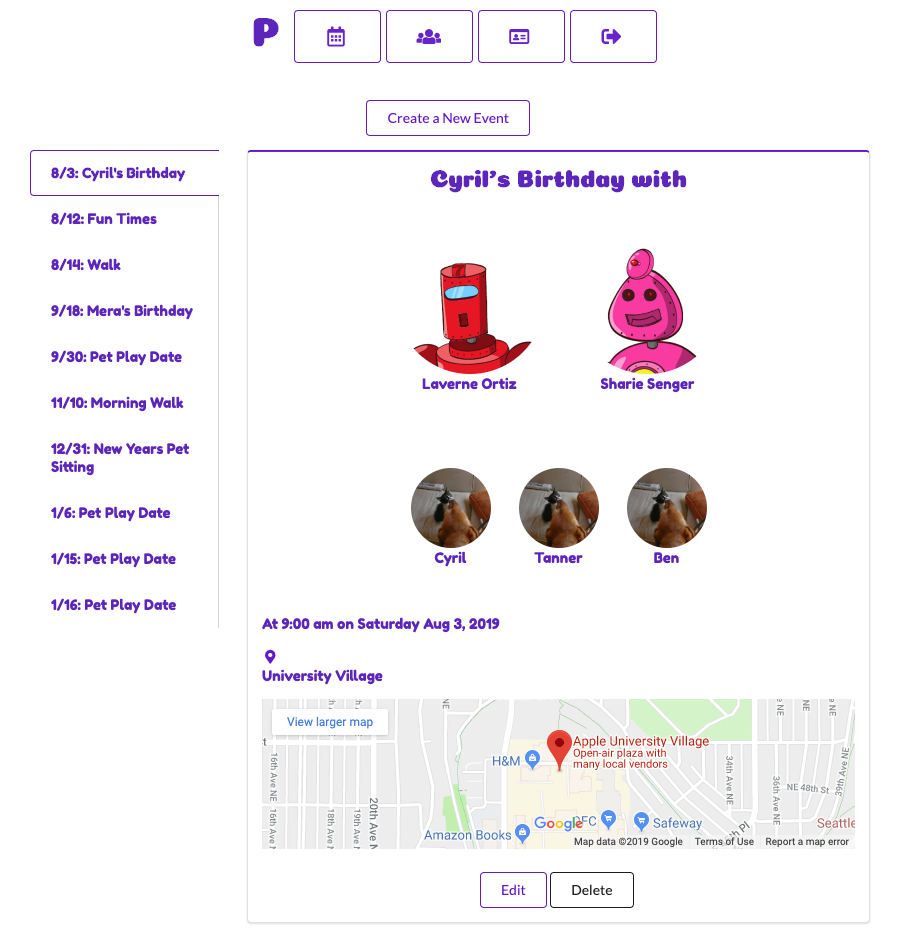

# PetConnect

Rails API backend of PetConnect, a social media app to connect with other pet owners and plan pet play dates!
(Add Gif here)

## Demo

[Vimeo demo](https://vimeo.com/349003287)


## Installation
* If you would like to use this repo locally, please download the frontend, which you can find [here](https://github.com/Mera-Stackhouse/pet-connect-frontend)
* Download [PostgreSQL](https://www.postgresql.org/) database
* Clone down this repo
* From the main folder in the terminal, run ```bundle install```
* Database creation
  * ```rails db:create```
  * ```rails db:migrate```
* Database initialization
  * A seed file is included with faker generated data
  * There are examples of how to create users, events, pets, relationships between all of them.
  * You must create users, events, and pets first.
  * Then comment out user and pet creation lines and use the user, pet, and event id's to make relationships between them.
* Start the server with ```rails s```
* Make sure your frontend refers to the correct port for fetching.

## Features of PetConnect
* Log in with your Google account using OAuth. If you have never logged in before, a new PetConnect account will be created for you.
* View and edit your profile.
* Add, edit, and remove your pets.
* Set up events with your fellow pet owners, including choosing the participating pets and the location.

## Technologies
* Google id token gem

## Credits

* Thank you to the following Stack Overflows and docs for helping me out:
  * https://blog.logrocket.com/advanced-react-router-concepts-code-splitting-animated-transitions-scroll-restoration-recursive-17096c0cf9db/
  * https://auth0.com/blog/react-router-4-practical-tutorial/
  * https://github.com/google/google-id-token
  * https://www.engineyard.com/blog/active-model-serializers


## License

* Under the [MIT License](docs/LICENSE.md)


* Database creation

* Database initialization

* Deployment instructions
